# Nanvi AI Enterprise Assistant

<p align="center">
  
</p>

<p align="center">
  <strong>Next-Generation Enterprise AI Copilot, Multi-Agent Orchestration & Knowledge Intelligence Platform</strong>
</p>

<p align="center">
  <a href="#-system-architecture"></a>
  <a href="#-security--zero-trust-governance"></a>
  <a href="#-testing--verification"></a>
  <a href="#-deployment-strategies"></a>
</p>

<p align="center">
  
  
  
  
  
  
  
  
</p>

---

## 📑 Table of Contents

- [Executive Summary](#-executive-summary)
- [System Architecture](#-system-architecture)
- [Core Enterprise Capabilities](#-core-enterprise-capabilities)
- [Zero-Trust Security & RBAC Matrix](#-zero-trust-security--rbac-matrix)
- [Multi-Modal Experience & Voice Engine](#-multi-modal-experience--voice-engine)
- [Universal Connections Hub](#-universal-connections-hub)
- [Technology Stack](#-technology-stack)
- [API Route Specifications](#-api-route-specifications)
- [Getting Started & Local Setup](#-getting-started--local-setup)
- [Pre-Configured Demo Accounts](#-pre-configured-demo-accounts)
- [Deployment Strategies](#-deployment-strategies)
- [Testing & Quality Assurance](#-testing--quality-assurance)
- [Repository Structure](#-repository-structure)
- [Compliance & Governance](#-compliance--governance)

---

## 🏛️ Executive Summary

Modern enterprise organizations suffer from acute **information fragmentation**: business documents are trapped in private directories, financial records reside in transactional SQL databases, communications are locked in mail servers, and team deliverables are scattered across cloud repositories. 

**Nanvi AI Enterprise Assistant** unifies disparate business silos into a single, highly secure, conversational intelligence interface. Engineered for corporate environments, Nanvi combines state-of-the-art multi-agent workflows (**LangGraph**) and accelerated inference (**Groq LLaMA 3.3 70B**) with strict **Zero-Trust Role-Based Access Control (RBAC)**.

### Core Value Drivers:
1. **Source Transparency**: Every statement is backed by verifiable citations (`/api/sources/{id}`) without ever exposing internal database credentials, file paths, or raw SQL queries.
2. **Deterministic Security Boundary**: AI models are never granted direct data access. All operations are mediated through a **Secure Tool Gateway** that enforces user identity, department isolation, and role authorization on every action.
3. **Multi-Modal Interaction**: Dual operational modes supporting desktop/mobile conversational chat and a hands-free **Interactive Voice Assistant** with live frequency visualization.
4. **Zero Vendor Lock-In**: Out-of-the-box support for PostgreSQL, Supabase, SQLite, Gmail, GitHub, and custom REST connections.

---

## 📐 System Architecture

Nanvi enforces a strict **layered defense-in-depth architecture**. The user interface is strictly a presentation client; all authorization, retrieval filters, and tool calls are validated server-side.

```mermaid
flowchart TB
    subgraph Client["Client Presentation Layer (React 19 + TypeScript)"]
        UI[Desktop / Mobile Chat Interface]
        Voice[Interactive Voice Assistant & Audio Visualizer]
        HubUI[Universal Connections Hub UI]
        AdminUI[Workspace & Company Folder Manager]
    end

    subgraph Security["API Gateway & Middlewares (FastAPI)"]
        ReqCtx[RequestContextMiddleware & Tracing]
        SecHead[SecurityHeadersMiddleware - HSTS / CSP]
        RateLim[Rate Limiter - Redis / In-Memory Fallback]
        AuthN[Bearer JWT / JWKS Token Validator]
    end

    subgraph Authorization["Central Authorization Engine"]
        RBAC[RBAC Policy - 6 Enterprise Roles]
        ABAC[ABAC Policy - Tenant & Department Isolation]
        Audit[Immutable Security Audit Logger]
    end

    subgraph Orchestration["Agent Orchestration (LangGraph + Groq)"]
        Supervisor[Enterprise Intent Router]
        KA[Knowledge Agent - Documents & Company Vault]
        DA[Database Agent - PostgreSQL & SQLite]
        EA[Email Agent - Gmail OAuth2 & Inbox Sync]
        AA[Data Analysis Agent - Metrics & Aggregations]
        RA[Report Agent - PDF / Markdown Exporter]
    end

    subgraph Gateway["Secure Tool Gateway"]
        STG[Policy Enforcer, Tool Budget & Input Sanitizer]
    end

    subgraph Integrations["Connected Enterprise Backends"]
        PG[(PostgreSQL / Supabase PgBouncer)]
        SQLITE[(SQLite Embedded Data)]
        VAULT[(Company Files - PDF, DOCX, PPTX, XLSX)]
        GMAIL[Gmail API via OAuth 2.0]
        SRC[Source Transparency Store]
    end

    Client -->|Bearer JWT / HTTPS| Security
    Security --> Authorization
    Authorization --> Orchestration
    Orchestration --> Gateway
    Gateway --> Integrations
    Integrations -->|Filtered Records| Gateway
    Gateway -->|Citations & Safe Data| Orchestration
    Orchestration -->|Verified Response + Source IDs| Client
```



---

## ⚡ Core Enterprise Capabilities

### 1. Multi-Agent LangGraph Orchestrator
- **Autonomous Capability Routing**: Translates natural language requests into targeted actions across 5 specialized agents (`KnowledgeAgent`, `DatabaseAgent`, `EmailAgent`, `DataAnalysisAgent`, `ReportAgent`).
- **Groq Inference Engine**: Powered by `llama-3.3-70b-versatile` operating under tight token budgets with fallback retry mechanics.
- **Hallucination Suppression**: Prompt contracts strictly require facts to be derived exclusively from retrieved sources. When data is absent or unauthorized, the agent clearly states its boundary.

### 2. Enterprise RAG 2.0 & Knowledge Vault
- **Multi-Format Ingestion**: High-fidelity parsing of Microsoft Word (`.docx`), PowerPoint (`.pptx`), Excel (`.xlsx`), Adobe PDF (`.pdf`), comma-separated values (`.csv`), and Markdown (`.md`/`.txt`).
- **Live Company Data Folder Sync**: Dynamically mirrors internal company directories with automatic department categorization (`Finance`, `Customers`, `HR`, `Contracts`, `Projects`, `Uploads`).
- **Ad-Hoc Document Ingestion (`/api/upload`)**: Allows authorized personnel to upload documents directly from the chat interface for instant RAG indexing.

### 3. Source Transparency & Citation Engine
- **Opaque Reference Tokens**: Rather than returning file system paths or database IDs, citations are returned as opaque tokens (e.g., `/api/sources/72742cbb-894c-4aed-bb28-8c36fa40d1a7`).
- **Re-Authorized Resolution**: When a user clicks a citation to inspect its content, the backend re-evaluates the requesting user's identity and permissions before returning the snippet.
- **Zero Raw SQL Leakage**: Database citations display human-readable source descriptions while scrubbing SQL expressions, table joins, and primary keys.

### 4. Executive Reporting Suite
- **Automated Report Generation**: Synthesizes cross-departmental findings into structured corporate reports.
- **Dual Format Output**:
  - High-resolution, paginated **PDF** documents generated via ReportLab with running headers, footers, and metadata.
  - Formatted **Markdown** documents with summary tables and executive takeaways.

---

## 🛡️ Zero-Trust Security & RBAC Matrix

Nanvi implements centralized **Role-Based Access Control (RBAC)** combined with **Attribute-Based Access Control (ABAC)** across 6 distinct enterprise roles:

| Capability / Resource | CEO | Finance | HR | Manager | Employee | IT Admin |
| :--- | :---: | :---: | :---: | :---: | :---: | :---: |
| **Executive Reports & KPIs** | ✅ Full | ❌ | ❌ | ❌ | ❌ | ❌ |
| **Financial Ledgers & Payroll** | ✅ Full | ✅ Full | ❌ | ❌ | ❌ | ❌ |
| **HR Records & Candidate Resumes** | ✅ Full | ❌ | ✅ Full | ❌ | ❌ | ❌ |
| **Department Sprint Plans & Files** | ✅ Full | Department | Department | ✅ Team | ❌ | ❌ |
| **General Policies & Knowledge** | ✅ Full | ✅ Full | ✅ Full | ✅ Full | ✅ Full | ✅ Full |
| **Ad-Hoc Document Upload** | ✅ Full | ✅ Full | ✅ Full | ✅ Full | ✅ Full | ✅ Full |
| **Connections Hub & Credentials** | ❌ | ❌ | ❌ | ❌ | ❌ | ✅ Full |
| **System Audit Logs & Telemetry** | ❌ | ❌ | ❌ | ❌ | ❌ | ✅ Full |

### Security Invariants:
1. **Frontend Isolation**: Role state in the UI is purely decorative for UX; the backend validates JWT claims and enforces access policy on every API call.
2. **Encrypted Credential Storage**: All third-party secrets, OAuth refresh tokens, and database passwords in the Connections Hub are encrypted at rest using **AES-256-GCM**.
3. **SSRF & SQL Injection Defense**:
   - Connection URLs undergo hostname resolution validation to prevent Server-Side Request Forgery.
   - Database queries are restricted to an allowlist of tables and executed within read-only transactions with strict statement timeouts.

---

## 🎙️ Multi-Modal Experience & Voice Engine

Nanvi bridges the gap between conventional text interfaces and ambient executive computing:

- **Continuous Voice Interaction**: Implements Web Speech recognition with adaptive silence detection for fluid, uninterrupted conversations.
- **Dynamic Frequency Visualizer**: Real-time canvas audio visualization that reacts dynamically to ambient volume and speech cadence.
- **Neural Speech Synthesis**: Integrated speech synthesis engine providing natural audio feedback for answers and executive summaries.
- **Interactive Robot Engine**: 3D/video Hero canvas animation featuring orbiting corporate repositories with interactive, clickable hotspots.

---

## 🔌 Universal Connections Hub

The Connections Hub enables enterprise administrators to bind live business systems directly to Nanvi:

```text
Universal Connections Hub
├── Relational Databases
│   ├── PostgreSQL (Native driver with statement timeouts & read-only enforcement)
│   ├── Supabase (Direct PgBouncer pooler support with transaction pooling)
│   └── SQLite (Local embedded database connector)
├── SaaS & Cloud APIs
│   ├── Gmail (OAuth 2.0 workflow with live inbox search and email body extraction)
│   ├── GitHub (Repository documentation & commit sync)
│   └── Generic REST API (Configurable bearer/basic authentication with JSON parsing)
└── Security Subsystem
    ├── AES-256-GCM envelope encryption for connection credentials
    ├── Pre-flight connection health probes and latency measurement
    └── Granular role-based connection exposure
```

---

## 💻 Technology Stack

| Domain | Technology | Version | Purpose |
| :--- | :--- | :--- | :--- |
| **Backend Framework** | FastAPI | `0.128.2` | High-performance asynchronous Python REST API |
| **Language Runtime** | Python | `3.11 - 3.13` | Backend execution runtime |
| **Validation & Typing** | Pydantic v2 | `2.13.4` | Data validation, request schemas, settings validation |
| **AI Orchestration** | LangGraph | `1.2.11` | Multi-agent state machines, cyclical graphs, tool routing |
| **LLM Inference** | Groq SDK | `llama-3.3-70b` | Ultra-low latency enterprise LLM inference |
| **Web Search** | Tavily Python | `>=0.5.0` | Real-time external knowledge retrieval |
| **Frontend Framework** | React | `19.0.0` | Component architecture with modern action hooks |
| **Language** | TypeScript | `5.7.2` | Strict client-side type safety |
| **Build Tool** | Vite | `6.4.3` | Optimized bundle generation and HMR dev server |
| **Styling** | Tailwind CSS | `4.3.3` | Modern CSS architecture |
| **Icons & Media** | Lucide React | `1.47.0` | Clean enterprise icon system |
| **Document Processing**| PyPDF, Python-Docx, Python-PPTX, OpenPyXL | Latest | Multi-format binary file parsing |
| **Reporting Engine** | ReportLab | `4.4.9` | Enterprise-grade PDF document synthesis |
| **Database Clients** | Psycopg 3, SQLite3 | `3.2.10` | High-throughput PostgreSQL and SQLite connectors |
| **Testing** | Pytest, Vitest | `9.0.2` / `5.0.1` | Comprehensive unit, integration, and E2E test suites |

---

## 🚦 API Route Specifications

| Method | Endpoint | Authorization | Description |
| :--- | :--- | :--- | :--- |
| `GET` | `/api/health` | None | Service liveness probe |
| `GET` | `/api/health/ready` | None | Readiness probe checking database & disk connectivity |
| `POST`| `/api/chat` | Bearer JWT | Main conversational AI query endpoint (LangGraph orchestrator) |
| `POST`| `/api/upload` | Bearer JWT | Direct document upload for RAG indexing (PDF, DOCX, XLSX, TXT) |
| `POST`| `/api/voice` | Bearer JWT | Optimized speech-to-intent endpoint for voice interactions |
| `GET` | `/api/sources/{id}` | Bearer JWT | Re-authorized citation resolution (returns clean, safe source data) |
| `GET` | `/api/history` | Bearer JWT | Retrieves user's authorized conversational session history |
| `GET` | `/api/reports` | Bearer JWT | Lists generated executive reports |
| `GET` | `/api/reports/{id}/download` | Bearer JWT | Secure binary download of PDF/Markdown reports |
| `GET` | `/api/connections` | IT Admin | Lists active enterprise connections and status |
| `POST`| `/api/connections` | IT Admin | Registers a new database or SaaS connection (encrypted) |
| `GET` | `/api/settings/company-folder` | Bearer JWT | Inspects the currently active corporate knowledge directory |
| `PUT` | `/api/settings/company-folder` | Manager+ | Updates active company folder path and triggers re-indexing |
| `POST`| `/api/dev/token` | Dev Mode | Generates development JWT tokens for instant role switching |

---

## 🛠️ Getting Started & Local Setup

### System Prerequisites
- **Python**: `3.11` or higher (`3.12` / `3.13` recommended)
- **Node.js**: `18.0` or higher with `npm`

### Step 1: Clone and Configure Environment

```bash
git clone https://github.com/your-org/nanvi-ai-enterprise-assistant.git
cd nanvi-ai-enterprise-assistant

# The repository is pre-configured with a working development .env
# To customize, inspect .env in the root directory
```

### Step 2: Backend Setup & Launch

```bash
# 1. Create and activate virtual environment
python -m venv venv

# Windows PowerShell:
venv\Scripts\Activate.ps1
# Linux/macOS:
# source venv/bin/activate

# 2. Install exact-pinned dependencies
pip install -r requirements.txt

# 3. Start the FastAPI development server
uvicorn backend.main:app --reload --host 127.0.0.1 --port 8000
```

- **API Base URL**: `http://127.0.0.1:8000`
- **Swagger Documentation**: `http://127.0.0.1:8000/docs`
- **Health Endpoint**: `http://127.0.0.1:8000/api/health`

### Step 3: Frontend Setup & Launch

Open a separate terminal:

```bash
cd frontend

# 1. Install frontend dependencies
npm install

# 2. Start Vite development server
npm run dev
```

- **Web Application URL**: `http://127.0.0.1:5173`

---

## 👥 Pre-Configured Demo Accounts

In development mode (`APP_ENV=development`), the system provides instant token generation for testing the 6 enterprise personas:

| Persona | Username | Password | Role | Department | Key Testing Scenario |
| :--- | :--- | :--- | :--- | :--- | :--- |
| **Chief Executive Officer** | `ceo` | `demo-pass` | `CEO` | Executive | Query company-wide EBITDA, executive reports, high-level summaries |
| **Finance Director** | `finance_user` | `demo-pass` | `Finance` | Finance | Query ledger balances, payroll documents, invoice approvals |
| **HR Director** | `hr_user` | `demo-pass` | `HR` | Human Resources | Search candidate resumes, personnel records, employee benefits |
| **Engineering Manager** | `manager_user` | `demo-pass` | `Manager` | Engineering | Query project specifications, sprint roadmaps, client contracts |
| **Enterprise Employee** | `employee_user` | `demo-pass` | `Employee` | General | Search public guidelines, company handbook, IT helpdesk |
| **System Administrator**| `admin_user` | `demo-pass` | `IT_ADMIN` | IT | Manage database connections, review audit logs, configure storage |

---

## 🚀 Deployment Strategies

Nanvi is engineered with a **dual deployment strategy**: immediate zero-friction serverless hosting on Vercel for demonstrations, alongside high-availability containerized blueprints for enterprise production.

### Strategy 1: Vercel Cloud Deployment (Turnkey)

The repository includes pre-built Vercel integration:
- Root [**`vercel.json`**](vercel.json): Automatically builds the Vite frontend and configures Python ASGI serverless routing.
- Serverless Entrypoint [**`api/index.py`**](api/index.py): Adapts FastAPI to Vercel's `@vercel/python` serverless runtime.
- Global Edge CDN: Static assets (including the 4.3 MB robot animation video, favicon, and brand logos) are served directly from Vercel Edge caching without requiring external link conversion.
- For complete step-by-step instructions, see the [**Vercel Deployment Guide**](docs/VERCEL_DEPLOYMENT_GUIDE.md).

### Strategy 2: Enterprise Cloud & On-Premises (Docker / Nginx / Kubernetes)

For high-concurrency production deployments requiring persistent Redis clusters, PgBouncer pooling, and dedicated worker threads:

```bash
# Build and launch production containers
cd deploy/docker
docker-compose -f docker-compose.yml up -d --build
```

- **Nginx Reverse Proxy**: Pre-configured in [`deploy/nginx/nginx.conf`](deploy/nginx/nginx.conf) with rate-limiting, SSL termination, and static asset offloading.
- **Database Schema**: Full PostgreSQL migration and seed scripts available in [`deploy/supabase_migration_and_seed.sql`](deploy/supabase_migration_and_seed.sql).

---

## 🧪 Testing & Quality Assurance

Nanvi adheres to strict software quality and verification standards:

```bash
# Execute comprehensive backend test suite (340+ tests)
pytest -q

# Execute frontend Vitest suite (56 tests)
cd frontend
npm run test

# Validate production frontend bundle build
npm run build
```

### Validation Highlights:
- **Zero Ingestion Failures**: Validated across hundreds of synthetic and real enterprise documents.
- **Business UAT Passed**: Complete business user acceptance test suite ([`test_doc/BUSINESS_UAT_VALIDATION_REPORT.md`](test_doc/BUSINESS_UAT_VALIDATION_REPORT.md)) verified with 100% acceptance.
- **SQL Sanitization**: Automated security tests prove that SQL queries and schema metadata are never leaked to user responses.

---

## 📂 Repository Structure

```text
nanvi_ai_enterprise_assistant/
├── backend/                            # Core FastAPI backend service
│   ├── agents/                         # LangGraph capability agents & tool gateway
│   │   ├── capability_agents.py        # Knowledge, Database, Email, Report, Analysis agents
│   │   └── security_gateway.py         # Secure Tool Gateway with execution budgets
│   ├── api/                            # REST route controllers
│   │   ├── chat_routes.py              # Conversational orchestrator & document upload
│   │   ├── voice_routes.py             # Optimized real-time voice streaming
│   │   ├── source_routes.py            # Re-authorized citation resolution
│   │   ├── email_routes.py             # Gmail synchronization & search
│   │   └── settings_routes.py          # Active company folder management
│   ├── chat/                           # Chat service models & session managers
│   ├── connections/                    # Universal Connections Hub (Postgres, Supabase, SQLite)
│   ├── core/                           # Application configuration & environment validation
│   ├── documents/                      # Binary document parsers (PDF, DOCX, PPTX, XLSX)
│   ├── integrations/                   # Database repositories & email adapters
│   ├── observability/                  # Logging, request context tracing & OpenTelemetry
│   ├── retrieval/                      # Hybrid retrieval (keyword + vector) & chunking
│   ├── security/                       # Centralized RBAC/ABAC authorization & rate limiters
│   ├── sources/                        # Safe citation token store & resolver
│   ├── bootstrap.py                    # Application dependency composition root
│   └── main.py                         # Primary FastAPI entrypoint & middleware pipeline
├── frontend/                           # React 19 + TypeScript frontend application
│   ├── public/                         # Public static assets (favicon.ico, video, logos)
│   ├── src/
│   │   ├── components/                 # Reusable UI widgets (Chat, Voice, Hotspots, Bento)
│   │   ├── features/                   # Business domain modules (Auth, Settings, Voice)
│   │   ├── hooks/                      # Custom hooks (useChat, useSession, useCompanyFolder)
│   │   ├── lib/                        # Formatting, Markdown sanitizer & security policies
│   │   ├── api.ts                      # Fully typed backend client boundary
│   │   └── App.tsx                     # Main application layout & view router
│   └── package.json                    # Frontend dependency manifests
├── api/                                # Vercel serverless functions
│   └── index.py                        # Vercel Python ASGI serverless bridge
├── deploy/                             # Production infrastructure assets
│   ├── docker/                         # Production Dockerfile & docker-compose manifests
│   ├── nginx/                          # Production Nginx reverse-proxy configuration
│   └── supabase_migration_and_seed.sql # Supabase PostgreSQL relational schema
├── docs/                               # Comprehensive engineering & architectural guides
├── tests/                              # 340+ automated Pytest unit and integration tests
├── vercel.json                         # Root Vercel deployment manifest
├── .vercelignore                       # Vercel upload exclusions
├── requirements.txt                    # Pinned Python dependencies
└── README.md                           # Enterprise documentation manifest
```

---

## 📜 Compliance & Governance

- **Data Privacy**: Customer data, query embeddings, and uploaded documents are processed ephemerally within the configured enterprise tenant. No customer data is shared or used to train third-party foundation models.
- **Audit Trails**: All access decisions, administrative actions, and tool calls produce structured JSON audit records with unique correlation IDs.
- **Confidentiality**: Proprietary Enterprise Intellectual Property. All rights reserved.
