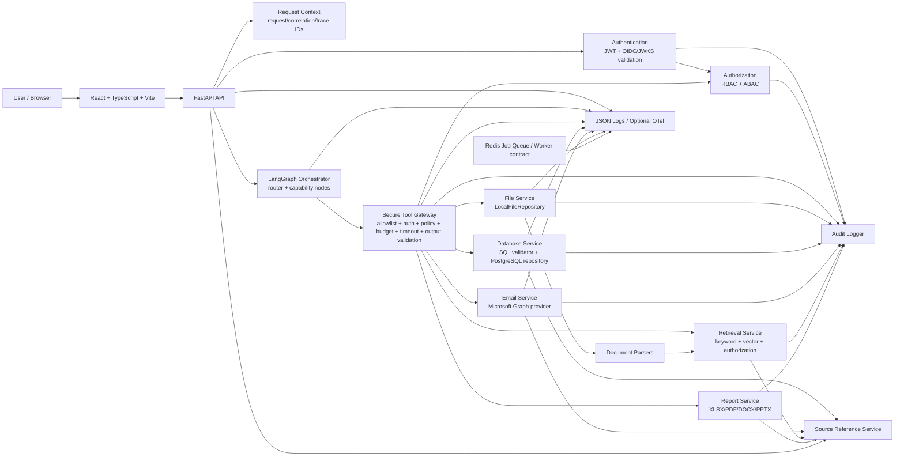

# System Architecture Diagram

## Implemented architecture

## Important implementation boundary

The diagram shows interfaces and existing service boundaries, not a claim that every edge is wired in the default application composition. In particular, concrete Knowledge/Email/Data Analysis/Report capability agents are not currently wired into the default `EnterpriseOrchestrator`.

## Planned/Future

Durable production stores, real LLM provider execution, distributed workers, managed SIEM/OTel and production OIDC callback/session handling remain deployment/integration work.

## Status classification

### Implemented
The diagram reflects implemented modules and their security/observability boundaries.

### Partially implemented
Some diagram edges are architectural relationships rather than default runtime wiring, especially capability-agent-to-tool integrations.

### Planned/Future
Durable infrastructure and complete production provider wiring remain future deployment work.
